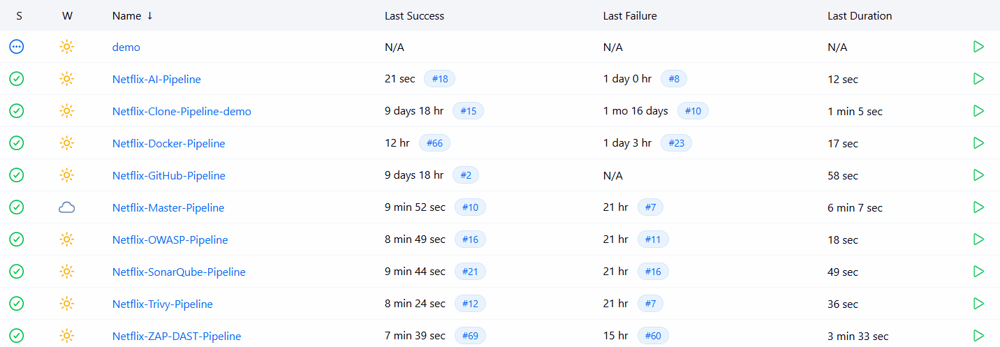
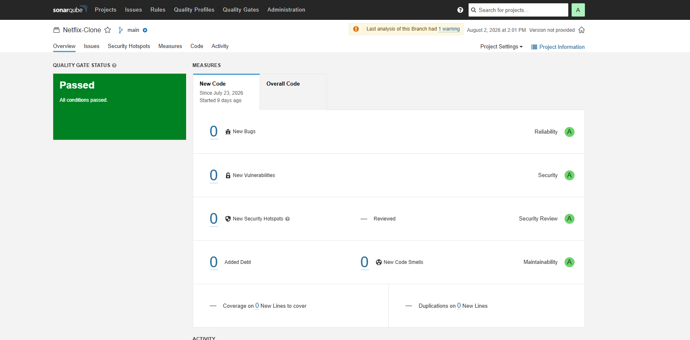
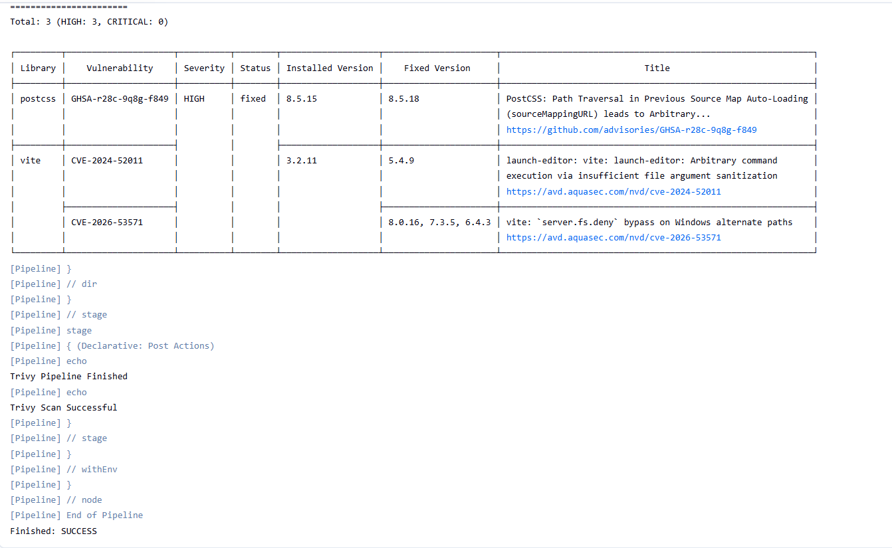
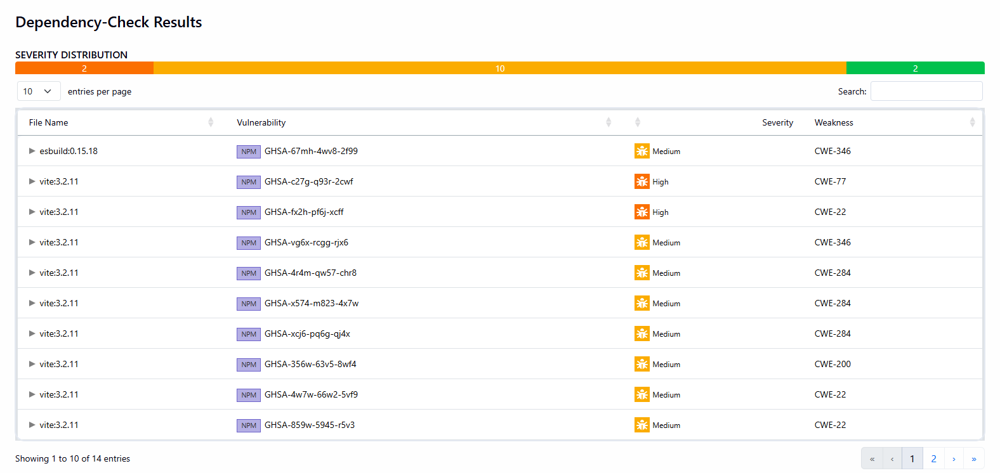
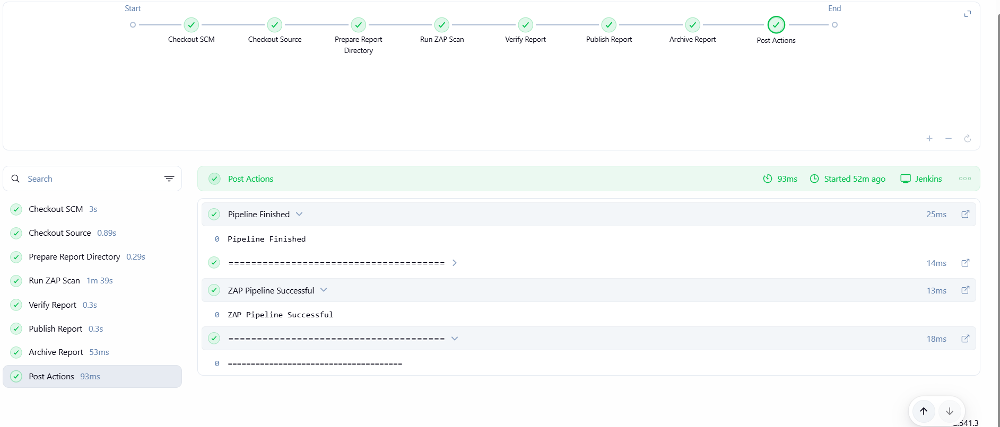
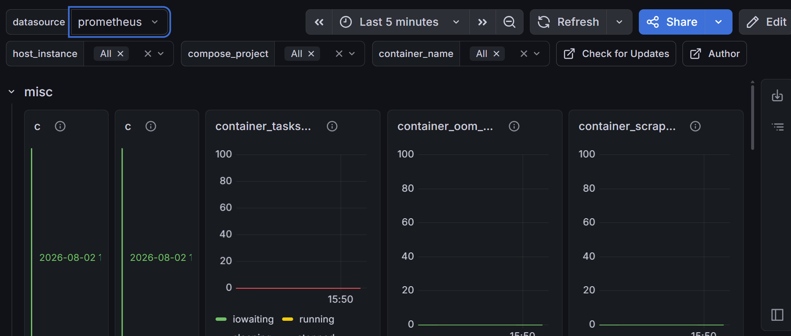
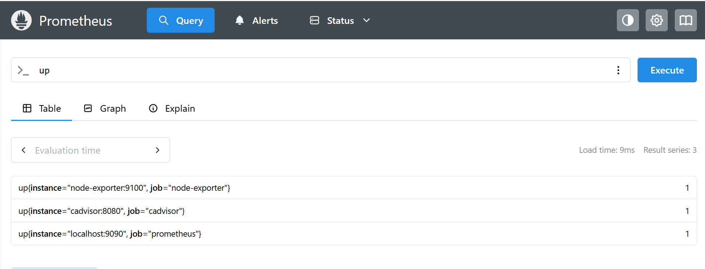
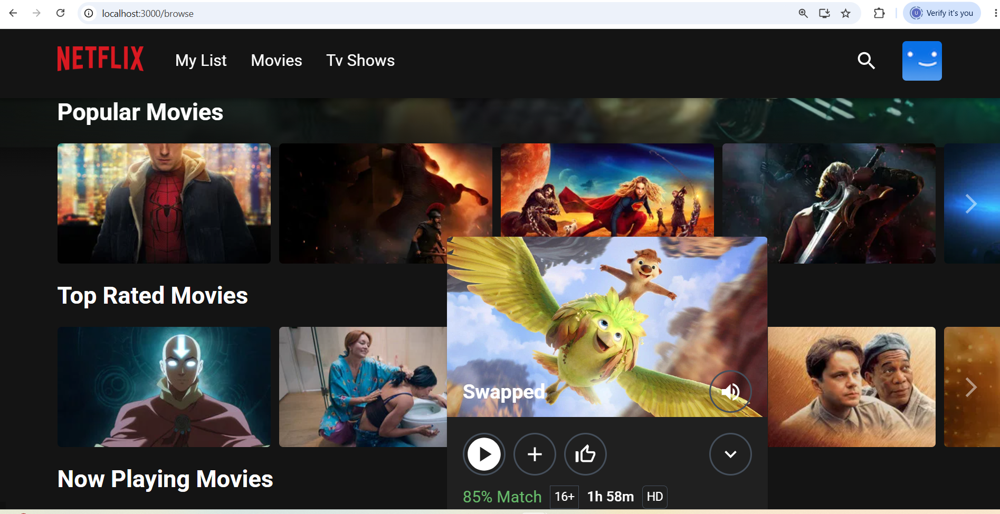

# 🚀 AI-Driven DevSecOps Pipeline with Machine Learning Dashboard for a Netflix Clone

## 📌 Project Overview

This project is a complete **AI-Driven DevSecOps Pipeline** that automates security scanning, vulnerability analysis, AI-based risk prediction, and security reporting using Jenkins.

The pipeline integrates multiple security tools including SonarQube, Trivy, OWASP Dependency Check, and OWASP ZAP. All generated security reports are merged into a unified dataset, processed using Machine Learning, and visualized through a Flask-based AI Dashboard.

In addition to security analysis, the project includes infrastructure monitoring using Prometheus and Grafana.

---

## 🎯 Project Objectives

- Automate Secure CI/CD using Jenkins
- Perform Static Application Security Testing (SAST)
- Perform Software Composition Analysis (SCA)
- Perform Container Vulnerability Scanning
- Perform Dynamic Application Security Testing (DAST)
- Predict Security Risk using Machine Learning
- Generate Interactive Security Dashboard
- Monitor Infrastructure using Prometheus & Grafana

---

## 🌟 Key Highlights

- AI Powered Security Dashboard
- Jenkins Master Pipeline
- SonarQube Code Quality Analysis
- Trivy Container Image Scan
- OWASP Dependency Check
- OWASP ZAP DAST Scan
- Machine Learning Risk Prediction
- Downloadable Security Reports
- Auto Refresh Dashboard
- Prometheus Monitoring
- Grafana Visualization

---
---

# ✨ Features

## 🔄 CI/CD Automation

- Jenkins Master Pipeline orchestrates the complete DevSecOps workflow.
- Individual Jenkins pipelines for SonarQube, Trivy, OWASP Dependency Check, OWASP ZAP, and AI Security.
- Automated execution of security scans and AI prediction.
- Dockerized deployment for all services.

---

## 🔒 Security Scanning

### SonarQube (SAST)

- Static code analysis for React application.
- Detects bugs, vulnerabilities, and code smells.
- Displays issue count in the AI dashboard.

### Trivy

- Container image vulnerability scanning.
- Detects Critical, High, Medium, and Low vulnerabilities.
- Integrated with AI prediction.

### OWASP Dependency Check

- Software Composition Analysis (SCA).
- Detects vulnerable third-party libraries.
- Generates JSON reports for AI processing.

### OWASP ZAP

- Dynamic Application Security Testing (DAST).
- Scans the running web application.
- Detects runtime security vulnerabilities.

---

## 🤖 Artificial Intelligence

- Merges security reports from multiple tools.
- Generates a unified dataset.
- Trains a Machine Learning model.
- Predicts application security risk.
- Generates an HTML AI Security Report.
- Displays AI prediction on the dashboard.

---

## 📊 AI Security Dashboard

The Flask-based dashboard provides:

- Executive Security Summary
- Overall Risk Score
- SonarQube Findings
- Trivy Vulnerabilities
- Dependency Check Findings
- Severity Summary Cards
- AI Security Prediction
- Security Findings Bar Chart
- Severity Distribution Doughnut Chart
- Latest Security Findings Table
- Downloadable Reports
- Auto Refresh Dashboard
- Last Updated Timestamp

---

## 📈 Monitoring

Infrastructure monitoring using:

- Prometheus
- Grafana
- Node Exporter
- cAdvisor

Provides:

- CPU Monitoring
- Memory Monitoring
- Container Monitoring
- Docker Metrics
- Jenkins Metrics
- Infrastructure Visualization

---

## 📦 Containerization

Docker containers used in the project:

- Jenkins
- SonarQube
- Flask AI Dashboard
- Netflix React Application
- Prometheus
- Grafana
- Node Exporter
- cAdvisor

---

## 📑 Reporting

The project automatically generates:

- SonarQube Report
- Trivy Report
- Dependency Check Report
- OWASP ZAP Report
- Merged Security Report
- AI Prediction Report
- HTML Security Report

---

## 📸 Dashboard Preview

> Screenshots will be added here.

---

## 📂 Repository Structure

Project structure documentation will be added in the next section.

---

## 🛠️ Technologies Used

---

# 🛠️ Technology Stack

| Category | Technologies |
|----------|--------------|
| **Frontend** | React.js, TypeScript, HTML5, CSS3, Bootstrap |
| **Backend** | Python, Flask |
| **Programming Languages** | Python, JavaScript, TypeScript |
| **CI/CD** | Jenkins |
| **Containerization** | Docker |
| **Machine Learning** | Scikit-learn, Pandas, NumPy |
| **Security Tools** | SonarQube, Trivy, OWASP Dependency Check, OWASP ZAP |
| **Monitoring** | Prometheus, Grafana, Node Exporter, cAdvisor |
| **Version Control** | Git, GitHub |
| **Operating System** | Ubuntu (WSL2), Docker Linux Containers |

---

# 🔧 Software & Tools

### Development

- Visual Studio Code
- Git
- GitHub
- Docker Desktop
- WSL2 (Ubuntu)

### DevSecOps

- Jenkins
- SonarQube
- Trivy
- OWASP Dependency Check
- OWASP ZAP

### AI & Backend

- Python 3
- Flask
- Scikit-learn
- Pandas
- NumPy

### Monitoring

- Prometheus
- Grafana
- Node Exporter
- cAdvisor

### Container Platform

- Docker
- Docker Hub

---

# 📦 Docker Containers Used

| Container | Purpose |
|------------|----------|
| Jenkins | CI/CD Automation |
| SonarQube | Static Application Security Testing |
| Netflix React App | Target Application |
| AI Dashboard | Flask-based AI Security Dashboard |
| Prometheus | Metrics Collection |
| Grafana | Metrics Visualization |
| Node Exporter | Host Monitoring |
| cAdvisor | Docker Container Monitoring |
| ZAP (Temporary) | Dynamic Application Security Testing |

---

# 🔄 Pipeline Workflow

The project executes the following workflow:

```text
Developer

↓

GitHub Repository

↓

Jenkins Master Pipeline

↓

SonarQube

↓

OWASP Dependency Check

↓

Trivy

↓

OWASP ZAP

↓

Netflix AI Pipeline

↓

Merge Security Reports

↓

Prepare Dataset

↓

Train Machine Learning Model

↓

Predict Security Risk

↓

Generate HTML Report

↓

Flask AI Dashboard

↓

Prometheus

↓

Grafana
```
---

# 📂 Project Structure

```text
Netflix-AI-Driven-DevSecOps/
│
├── README.md
├── LICENSE
├── .gitignore
│
├── netflix-clone-app/
│   ├── src/
│   ├── public/
│   ├── Dockerfile
│   ├── package.json
│   ├── Jenkinsfile-master
│   ├── Jenkinsfile-sonarqube
│   ├── Jenkinsfile-trivy
│   ├── Jenkinsfile-owasp
│   ├── Jenkinsfile-zap
│   └── ...
│
├── ai-security/
│   ├── app.py
│   ├── Dockerfile
│   ├── requirements.txt
│   ├── templates/
│   ├── scripts/
│   ├── model/
│   ├── data/
│   ├── output/
│   └── ...
│
├── docs/
│   ├── architecture.png
│   ├── pipeline.png
│   └── ...
│
├── screenshots/
│   ├── dashboard-home.png
│   ├── grafana-dashboard.png
│   ├── sonar-dashboard.png
│   ├── trivy-report.png
│   ├── zap-report.png
│   └── ...
│
└── docker-compose.yml (Optional)
```

---

# 🚀 Installation & Setup Guide

## 📋 Prerequisites

Before running the project, ensure the following software is installed:

| Software | Version |
|-----------|----------|
| Git | Latest |
| Docker Desktop | Latest |
| WSL2 (Ubuntu) | Ubuntu 24.04 LTS |
| Jenkins | Docker Container |
| Python | 3.13 |
| Node.js | 18+ |
| npm | Latest |

---

---

# ▶️ Usage Guide

## Running the Complete DevSecOps Pipeline

Start the following Docker containers before executing the pipeline:

- Jenkins
- SonarQube
- Prometheus
- Grafana
- Node Exporter
- cAdvisor
- Netflix React Application
- AI Dashboard

Verify that all required containers are running:

```bash
docker ps
```

---

# 🚀 Execute the Master Pipeline

Open Jenkins:

```
http://localhost:8081
```

Run:

```
Netflix-Master-Pipeline
```

The Master Pipeline automatically executes the following stages:

```
Start Pipeline

↓

SonarQube Scan

↓

OWASP Dependency Check

↓

Trivy Container Scan

↓

OWASP ZAP Scan

↓

AI Security Pipeline

↓

Pipeline Completed
```

---

# 🤖 AI Security Pipeline

The AI Security Pipeline performs:

1. Copy Security Reports
2. Merge Security Reports
3. Prepare Training Dataset
4. Train Machine Learning Model
5. Predict Security Risk
6. Generate HTML Security Report

---

# 📊 Dashboard

Once the AI pipeline completes successfully, open:

```
http://localhost:5000
```

The dashboard displays:

- Executive Security Summary
- Risk Score
- SonarQube Findings
- Trivy Vulnerabilities
- Dependency Check Findings
- Severity Distribution
- AI Prediction
- Latest Security Findings
- Download Reports

---

# 🔄 Auto Refresh

The dashboard automatically refreshes every **30 seconds**.

The **Last Updated** timestamp changes only when a new AI prediction (`prediction.csv`) is generated after a successful pipeline execution.

---

# 📈 Monitoring Dashboard

Open Grafana:

```
http://localhost:3001
```

Open Prometheus:

```
http://localhost:9090
```

The monitoring stack provides:

- CPU Usage
- Memory Usage
- Docker Container Metrics
- Jenkins Metrics
- Infrastructure Monitoring

---

# 📥 Generated Reports

The pipeline generates the following reports:

| Report | Location |
|---------|----------|
| SonarQube Report | `security/sonarqube/` |
| Trivy Report | `security/trivy/` |
| Dependency Check Report | `security/dependency-check/` |
| ZAP Report | `security/zap/` |
| Merged Report | `ai-security/data/merged_reports.json` |
| Prediction | `ai-security/output/prediction.csv` |
| HTML Report | `ai-security/output/security_report.html` |

---

# ✅ Expected Pipeline Flow

```text
Developer

↓

GitHub Repository

↓

Netflix-Master-Pipeline

↓

SonarQube

↓

Dependency Check

↓

Trivy

↓

OWASP ZAP

↓

Netflix-AI-Pipeline

↓

Merge Reports

↓

AI Model

↓

Prediction

↓

Flask Dashboard

↓

Prometheus

↓

Grafana
```

---
# 📥 Clone the Repository

```bash
git clone https://github.com/sapna96324/netflix_clone_project.git

cd <YOUR_REPOSITORY_NAME>
```

---

# 🐳 Build the Netflix Application

Navigate to the React application:

```bash
cd netflix-clone-app
```

Build the Docker image:

```bash
docker build -t netflix-clone:v1 .
```

Run the application:

```bash
docker run -d \
--name netflix-app \
-p 3000:80 \
netflix-clone:v1
```

Verify:

```
http://localhost:3000
```

---

# 🤖 Build the AI Dashboard

Navigate to the AI module:

```bash
cd ai-security
```

Build the dashboard image:

```bash
docker build -t ai-dashboard:v1 .
```

Run the dashboard:

```bash
docker run -d \
--name ai-dashboard \
-p 5000:5000 \
-v /var/lib/docker/volumes/jenkins_home/_data/workspace/Netflix-AI-Pipeline/ai-security/data:/app/data \
-v /var/lib/docker/volumes/jenkins_home/_data/workspace/Netflix-AI-Pipeline/ai-security/output:/app/output \
ai-dashboard:v1
```

Verify:

```
http://localhost:5000
```

---

# ⚙️ Jenkins Configuration

Create the following Jenkins pipelines:

- Netflix-Master-Pipeline
- Netflix-SonarQube-Pipeline
- Netflix-Trivy-Pipeline
- Netflix-OWASP-Pipeline
- Netflix-ZAP-DAST-Pipeline
- Netflix-AI-Pipeline

Configure each pipeline to use its corresponding Jenkinsfile.

---

# 🔍 SonarQube Setup

Start SonarQube:

```
http://localhost:9000
```

Configure:

- SonarQube Server
- Authentication Token
- Quality Gate

Add the SonarQube server in Jenkins.

---

# 🛡️ Trivy Setup

Install Trivy on the Jenkins host.

Verify installation:

```bash
trivy --version
```

---

# 📦 OWASP Dependency Check

Install the Dependency Check Jenkins Plugin.

Configure:

- NVD API Key (Optional)
- Scan Output Directory

---

# 🌐 OWASP ZAP

Run the ZAP Docker image.

Configure the target URL inside the Jenkins pipeline.

---

# 📈 Monitoring Stack

Start the monitoring containers:

- Prometheus
- Grafana
- Node Exporter
- cAdvisor

Access:

| Service | URL |
|----------|-----|
| Prometheus | http://localhost:9090 |
| Grafana | http://localhost:3001 |
| Node Exporter | http://localhost:9100 |
| cAdvisor | http://localhost:8082 |

---

# ▶️ Running the Complete Pipeline

Execute the following Jenkins job:

```
Netflix-Master-Pipeline
```

The pipeline automatically performs:

1. SonarQube Scan
2. OWASP Dependency Check
3. Trivy Scan
4. OWASP ZAP Scan
5. AI Security Pipeline
6. AI Prediction
7. HTML Report Generation
8. Dashboard Update

---

# 🌐 Dashboard URLs

| Dashboard | URL |
|-----------|-----|
| Netflix Application | http://localhost:3000 |
| AI Security Dashboard | http://localhost:5000 |
| Jenkins | http://localhost:8081 |
| SonarQube | http://localhost:9000 |
| Prometheus | http://localhost:9090 |
| Grafana | http://localhost:3001 |

---
---

# 📁 Directory Description

## 📂 netflix-clone-app/

Contains the Netflix Clone React application.

Includes:

- React + TypeScript source code
- Dockerfile
- Package configuration
- Jenkins pipeline definitions
- Application build files

---

## 📂 ai-security/

Contains the complete AI Security module.

Includes:

- Flask Dashboard
- Machine Learning Model
- AI Prediction
- HTML Report Generator
- Dataset Preparation Scripts
- Report Merge Scripts
- Dashboard Templates

---

## 📂 templates/

Contains all Flask HTML templates.

Examples:

- Dashboard
- Charts
- AI Prediction UI

---

## 📂 scripts/

Contains automation scripts.

Examples:

- Merge Security Reports
- Prepare Dataset
- Train AI Model
- Predict Security Risk
- Generate HTML Report

---

## 📂 data/

Stores generated security data.

Examples:

- merged_reports.json
- Training Dataset
- Security Reports

---

## 📂 output/

Stores AI-generated results.

Examples:

- prediction.csv
- security_report.html

---

## 📂 docs/

Contains project documentation.

Examples:

- Architecture Diagram
- Pipeline Diagram
- Design Documents

---

## 📂 screenshots/

Contains screenshots used in the README.

Examples:

- Jenkins Dashboard
- SonarQube
- Trivy
- Grafana
- AI Dashboard

---

# 📜 Important Files

| File | Description |
|------|-------------|
| README.md | Project Documentation |
| Dockerfile | Builds Docker Images |
| requirements.txt | Python Dependencies |
| package.json | React Dependencies |
| Jenkinsfile-master | Master DevSecOps Pipeline |
| Jenkinsfile-sonarqube | SonarQube Pipeline |
| Jenkinsfile-trivy | Trivy Pipeline |
| Jenkinsfile-owasp | OWASP Dependency Check Pipeline |
| Jenkinsfile-zap | ZAP DAST Pipeline |
| app.py | Flask AI Dashboard |
| merge_reports.py | Merges all security reports |
| train_model.py | Trains Machine Learning Model |
| predict.py | Generates AI Prediction |

---

---
# 📂 Project Modules

The project consists of the following major modules:

### 1. Netflix React Application

- React + TypeScript frontend
- Dockerized application
- Used as the security scan target

---

### 2. Jenkins Master Pipeline

Responsible for:

- SonarQube Scan
- Trivy Scan
- OWASP Dependency Check
- OWASP ZAP Scan
- Triggering AI Security Pipeline

---

### 3. AI Security Module

Responsible for:

- Report Collection
- Report Merging
- Dataset Preparation
- Machine Learning Training
- Risk Prediction
- HTML Report Generation

---

### 4. AI Dashboard

Provides:

- Executive Summary
- AI Prediction
- Security Charts
- Severity Analysis
- Latest Findings
- Download Reports

---

### 5. Monitoring Stack

Includes:

- Prometheus
- Grafana
- Node Exporter
- cAdvisor

Provides real-time infrastructure monitoring.

---

---

## 📖 Documentation

Detailed setup and execution guide will be added below.

---

# 📸 Project Screenshots

## 1. Jenkins Dashboard

The Jenkins Dashboard manages all CI/CD pipelines used in this project.



---

## 2. Master Pipeline

The Master Pipeline orchestrates the complete AI-Driven DevSecOps workflow.


---

## 3. SonarQube Dashboard

Static code analysis including Bugs, Vulnerabilities, Code Smells, and Quality Gate.



---

## 4. Trivy Container Scan

Container vulnerability scanning using Trivy.



---

## 5. OWASP Dependency Check

Software Composition Analysis (SCA) for third-party libraries.



---

## 6. OWASP ZAP DAST

Dynamic Application Security Testing (DAST) report.



---

## 7. AI Security Dashboard

Interactive AI-powered security dashboard with live metrics, severity distribution, AI prediction, and downloadable reports.


---

## 8. Grafana Dashboard

Infrastructure and container monitoring using Grafana.



---

## 9. Prometheus Dashboard

Metrics collection for monitoring the DevSecOps environment.



---

## 10. Netflix Clone Application

The deployed React application secured through the DevSecOps pipeline.



---
